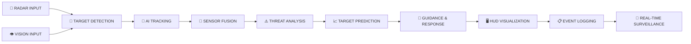
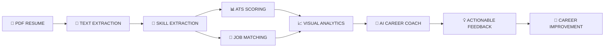

 

  

---

  

<table width="92%" cellspacing="0" cellpadding="18">
<tr>
<td align="center">

<b>👤 IDENTITY</b>

  

SHUBHAM KARDEL

</td>

<td align="center">

<b>🎯 ROLE</b>

  

AI / ML ENGINEER

</td>

<td align="center">

<b>🐍 PRIMARY</b>

  

PYTHON

</td>

<td align="center">

<b>🟢 STATUS</b>

  

SYSTEM ONLINE

</td>
</tr>

<tr>

<td align="center">

<b>🧠 CORE</b>

  

AI • ML • DL

</td>

<td align="center">

<b>👁️ VISION</b>

  

COMPUTER VISION

</td>

<td align="center">

<b>✨ GENAI</b>

  

LLMs • RAG • AGENTS

</td>

<td align="center">

<b>🛡️ MISSION</b>

  

AEGISAI

</td>

</tr>
</table>

 

---

# 🧬 ABOUT THE ENGINEER

I am an aspiring **Artificial Intelligence & Machine Learning Engineer** focused on building intelligent software systems and practical AI applications.

🎓 **MCA — Artificial Intelligence & Data Science**

My engineering interests span:

`Artificial Intelligence` • `Machine Learning` • `Deep Learning`

`Computer Vision` • `Generative AI` • `Natural Language Processing`

`AI Agents` • `Backend Engineering` • `MLOps` • `Software Architecture`

My goal is to develop **production-oriented AI systems** that combine intelligent models, robust software engineering, real-time processing, and scalable architecture.

---

# 🛡️ FLAGSHIP SYSTEM // AEGISAI

 

  

 

> **AegisAI** is an AI-powered radar surveillance and threat analysis platform designed to simulate an intelligent real-time surveillance environment.

The system combines radar visualization, AI tracking, computer vision, sensor fusion, target prediction, threat analysis, missile guidance concepts, event logging, and a real-time HUD interface.

---

## ⚡ AEGISAI SYSTEM CAPABILITIES

<table width="100%" cellspacing="0" cellpadding="22">

<tr>

<td align="center">

📡

### RADAR ENGINE

Real-Time Scanning

Dynamic Sweep

Target Visualization

Radar Detection

</td>

<td align="center">

🎯

### AI TRACKING

Multi-Object Tracking

Stable Track IDs

Target Management

Track Confidence

</td>

<td align="center">

👁️

### COMPUTER VISION

Visual Detection

Object Recognition

YOLO Integration

Vision Fusion

</td>

</tr>

<tr>

<td align="center">

🧠

### THREAT ANALYSIS

Target Classification

Threat Assessment

Priority Analysis

Intelligence Layer

</td>

<td align="center">

🔗

### SENSOR FUSION

Multi-Source Data

Unified Intelligence

Radar + Vision

System Coordination

</td>

<td align="center">

📈

### PREDICTION

Movement Analysis

Track Prediction

Trajectory Estimation

Future Expansion

</td>

</tr>

<tr>

<td align="center">

🚀

### GUIDANCE SYSTEM

Target Lock

Missile Guidance

Trajectory Logic

Impact Simulation

</td>

<td align="center">

🖥️

### COMMAND HUD

FPS Monitor

Status Display

Angle Tracking

Real-Time Events

</td>

<td align="center">

📋

### EVENT SYSTEM

Track Events

Threat Events

System Logs

Mission History

</td>

</tr>

</table>

---

## ⚡ AEGISAI INTELLIGENCE PIPELINE

---

## 📊 AEGISAI DEVELOPMENT STATUS

<table width="95%" cellspacing="0" cellpadding="16">

<tr>
<th>MODULE</th>
<th>STATUS</th>
<th>PROGRESS</th>
</tr>

<tr>
<td>📡 Radar Engine</td>
<td>🟢 ONLINE</td>
<td>████████████████████ 100%</td>
</tr>

<tr>
<td>🎯 Stable Track IDs</td>
<td>🟢 ONLINE</td>
<td>████████████████████ 100%</td>
</tr>

<tr>
<td>🎯 Multi-Object Tracking</td>
<td>🟢 ONLINE</td>
<td>████████████████████ 100%</td>
</tr>

<tr>
<td>⚠️ Threat Detection</td>
<td>🟢 ONLINE</td>
<td>████████████████████ 100%</td>
</tr>

<tr>
<td>👁️ Computer Vision</td>
<td>🟢 ONLINE</td>
<td>████████████████████ 100%</td>
</tr>

<tr>
<td>🖥️ HUD Interface</td>
<td>🟢 ONLINE</td>
<td>████████████████████ 100%</td>
</tr>

<tr>
<td>📋 Event Logging</td>
<td>🟢 ONLINE</td>
<td>████████████████████ 100%</td>
</tr>

<tr>
<td>🚀 Missile Guidance</td>
<td>🟡 DEVELOPING</td>
<td>██████████████░░░░░░ 70%</td>
</tr>

<tr>
<td>⚠️ Track Confidence Decay</td>
<td>🟡 DEVELOPING</td>
<td>██████████░░░░░░░░░░ 50%</td>
</tr>

<tr>
<td>📈 Track Prediction</td>
<td>🟡 DEVELOPING</td>
<td>████████░░░░░░░░░░░░ 40%</td>
</tr>

<tr>
<td>✨ Radar Trail History</td>
<td>🟡 DEVELOPING</td>
<td>███████░░░░░░░░░░░░░ 35%</td>
</tr>

<tr>
<td>🔄 Advanced Radar Effects</td>
<td>🟡 DEVELOPING</td>
<td>██████░░░░░░░░░░░░░░ 30%</td>
</tr>

</table>

 

---

# 📄 AI PRODUCT // RESUME ANALYZER AI

 

  

 

Resume Analyzer AI is an intelligent application designed to analyze resumes against job descriptions and provide actionable career insights.

---

## 🔄 AI ANALYSIS PIPELINE

---

## 🧩 RESUME ANALYZER CAPABILITIES

<table width="100%" cellspacing="0" cellpadding="20">

<tr>

<td align="center">

📄

### PDF ENGINE

Resume Processing

Text Extraction

Document Parsing

</td>

<td align="center">

🧠

### NLP ENGINE

Skill Detection

Keyword Analysis

Entity Extraction

</td>

<td align="center">

📊

### ATS ENGINE

Resume Scoring

Structure Analysis

ATS Optimization

</td>

</tr>

<tr>

<td align="center">

🎯

### MATCH ENGINE

Resume vs JD

Skill Comparison

Match Percentage

</td>

<td align="center">

🤖

### AI COACH

Intelligent Feedback

Career Guidance

Improvement Suggestions

</td>

<td align="center">

📈

### ANALYTICS

Visual Reports

Score Breakdown

Performance Insights

</td>

</tr>

</table>

---

# 🧰 TECHNOLOGY ARSENAL

  

---

## 💻 ENGINEERING STACK

<table width="100%" cellspacing="0" cellpadding="20">

<tr>

<td align="center">

### 💻 PROGRAMMING

🐍 Python

⚡ C++

🗄️ SQL

</td>

<td align="center">

### 🤖 AI / ML

Machine Learning

Deep Learning

Computer Vision

Generative AI

</td>

<td align="center">

### 📚 FRAMEWORKS

PyTorch

Scikit-Learn

OpenCV

FastAPI

</td>

<td align="center">

### 🛠️ TOOLS

Git

GitHub

Docker

Jupyter

PyCharm

</td>

</tr>

</table>

---

# 🧠 AI CAPABILITY MATRIX

<table width="95%" cellspacing="0" cellpadding="15">

<tr>
<th>DOMAIN</th>
<th>CAPABILITY</th>
<th>STATUS</th>
</tr>

<tr>
<td>🐍 Python</td>
<td>AI Application Development</td>
<td>🟢 Advanced Focus</td>
</tr>

<tr>
<td>🤖 Machine Learning</td>
<td>Model Development & Evaluation</td>
<td>🟢 Active</td>
</tr>

<tr>
<td>🔥 Deep Learning</td>
<td>Neural Networks & PyTorch</td>
<td>🟡 Advancing</td>
</tr>

<tr>
<td>👁️ Computer Vision</td>
<td>Detection & Tracking</td>
<td>🟢 Active</td>
</tr>

<tr>
<td>✨ Generative AI</td>
<td>LLMs & AI Applications</td>
<td>🟡 Advancing</td>
</tr>

<tr>
<td>🔎 NLP</td>
<td>Text & Skill Extraction</td>
<td>🟢 Active</td>
</tr>

<tr>
<td>🌐 FastAPI</td>
<td>AI Backend APIs</td>
<td>🟡 Advancing</td>
</tr>

<tr>
<td>🐳 Docker</td>
<td>Containerization</td>
<td>🟡 Learning</td>
</tr>

<tr>
<td>☁️ MLOps</td>
<td>Production AI Systems</td>
<td>🟡 Learning</td>
</tr>

</table>

---

# 📡 LIVE DEVELOPMENT MONITOR

  

<table width="95%" cellspacing="0" cellpadding="16">

<tr>
<th>SYSTEM</th>
<th>STATE</th>
<th>CURRENT OPERATION</th>
</tr>

<tr>
<td>🛡️ AegisAI</td>
<td>🟢 ACTIVE</td>
<td>Radar & AI Surveillance Development</td>
</tr>

<tr>
<td>📄 Resume Analyzer AI</td>
<td>🟢 ACTIVE</td>
<td>ATS & Career Intelligence</td>
</tr>

<tr>
<td>👁️ Computer Vision</td>
<td>🟢 ACTIVE</td>
<td>Detection & Tracking Research</td>
</tr>

<tr>
<td>🧠 Generative AI</td>
<td>🟡 LEARNING</td>
<td>LLMs, RAG & AI Agents</td>
</tr>

<tr>
<td>☁️ MLOps</td>
<td>🟡 LEARNING</td>
<td>Deployment & Production Systems</td>
</tr>

<tr>
<td>🏗️ System Design</td>
<td>🟡 LEARNING</td>
<td>Scalable AI Architecture</td>
</tr>

</table>

 

---

# 📚 LEARNING MATRIX

<table width="95%" cellspacing="0" cellpadding="14">

<tr>
<th>AREA</th>
<th>MISSION</th>
<th>STATUS</th>
</tr>

<tr>
<td>🧠 Large Language Models</td>
<td>LLM Application Engineering</td>
<td>🟢 Active</td>
</tr>

<tr>
<td>🔎 RAG Systems</td>
<td>Knowledge Retrieval Pipelines</td>
<td>🟢 Active</td>
</tr>

<tr>
<td>🤖 AI Agents</td>
<td>Autonomous AI Workflows</td>
<td>🟢 Active</td>
</tr>

<tr>
<td>🔥 Deep Learning</td>
<td>Advanced Neural Networks</td>
<td>🟢 Active</td>
</tr>

<tr>
<td>👁️ Computer Vision</td>
<td>Advanced Detection & Tracking</td>
<td>🟢 Active</td>
</tr>

<tr>
<td>🎮 Reinforcement Learning</td>
<td>Intelligent Decision Systems</td>
<td>🟡 Learning</td>
</tr>

<tr>
<td>🌐 FastAPI</td>
<td>Production AI APIs</td>
<td>🟢 Active</td>
</tr>

<tr>
<td>🐳 Docker</td>
<td>Containerized Deployment</td>
<td>🟡 Learning</td>
</tr>

<tr>
<td>⚙️ MLOps</td>
<td>AI Production Lifecycle</td>
<td>🟡 Learning</td>
</tr>

<tr>
<td>🏗️ System Design</td>
<td>Scalable Software Architecture</td>
<td>🟡 Learning</td>
</tr>

</table>

---

# 🎯 2026 MISSION CONTROL

  

<table width="95%" cellspacing="0" cellpadding="15">

<tr>
<th>MISSION OBJECTIVE</th>
<th>PRIORITY</th>
<th>STATUS</th>
</tr>

<tr>
<td>🚀 Build Production-Level AI Applications</td>
<td>🔴 HIGH</td>
<td>🟢 ACTIVE</td>
</tr>

<tr>
<td>🛡️ Complete AegisAI v2.1</td>
<td>🔴 HIGH</td>
<td>🟢 ACTIVE</td>
</tr>

<tr>
<td>👁️ Master Advanced Computer Vision</td>
<td>🔴 HIGH</td>
<td>🟢 ACTIVE</td>
</tr>

<tr>
<td>✨ Build Generative AI Applications</td>
<td>🟠 HIGH</td>
<td>🟢 ACTIVE</td>
</tr>

<tr>
<td>☁️ Learn MLOps & Cloud Deployment</td>
<td>🟠 MEDIUM</td>
<td>🟡 LEARNING</td>
</tr>

<tr>
<td>🧩 Strengthen DSA & Problem Solving</td>
<td>🟠 MEDIUM</td>
<td>🟡 IMPROVING</td>
</tr>

<tr>
<td>🌍 Contribute to Open Source</td>
<td>🟡 MEDIUM</td>
<td>🔵 PLANNED</td>
</tr>

<tr>
<td>📝 Publish Technical Articles</td>
<td>🟡 MEDIUM</td>
<td>🔵 PLANNED</td>
</tr>

</table>

---

# 🧩 AI PROJECT ECOSYSTEM

<table width="100%" cellspacing="0" cellpadding="22">

<tr>

<td align="center">

  

🛡️

### INTELLIGENT SURVEILLANCE

AI + Computer Vision

Radar Systems

Target Tracking

Threat Analysis

Sensor Fusion

</td>

<td align="center">

  

📄

### CAREER INTELLIGENCE

NLP

ATS Analysis

Skill Extraction

Job Matching

AI Feedback

</td>

<td align="center">

  

🚀

### NEXT GENERATION AI

AI Agents

RAG

LLMs

Automation

MLOps

</td>

</tr>

</table>

---

# 📈 GITHUB INTELLIGENCE CENTER

  

  

---

# 🧠 ENGINEERING PHILOSOPHY

  

<table width="90%" cellspacing="0" cellpadding="22">

<tr>

<td align="center">

> **"Great software isn't built in a day.**
>
> **It's engineered through continuous learning, disciplined practice, and relentless improvement."**

</td>

</tr>

</table>

---

# 🌐 CONNECT WITH ME

  

  

  

---

  

<table width="90%" cellspacing="0" cellpadding="25">

<tr>

<td align="center">

  

### ⭐ THANK YOU FOR VISITING MY GITHUB PROFILE!

 

  

**If you find my projects interesting, feel free to explore my repositories, connect with me, and follow the journey.**

  

</td>

</tr>

</table>

 

  

  

